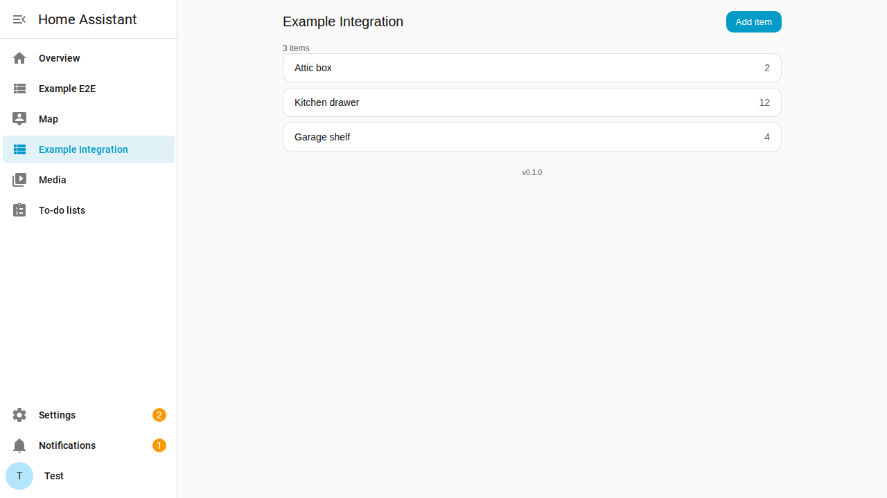
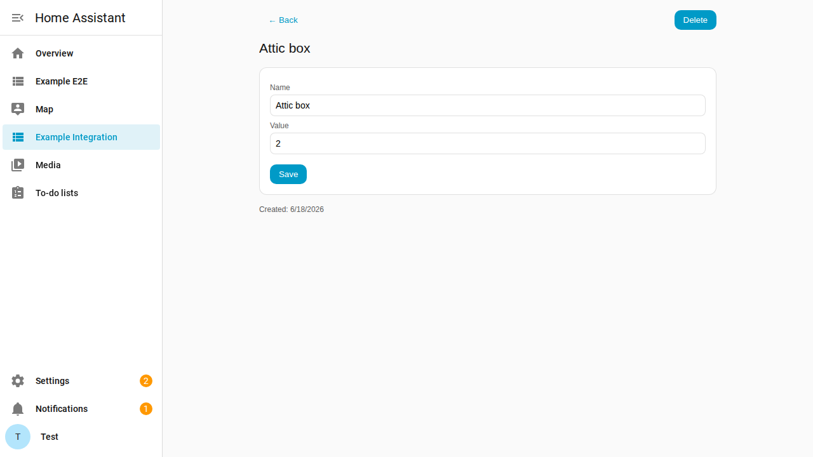
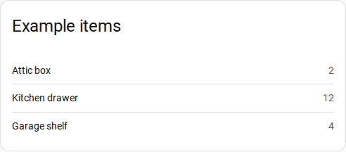

# HA Integration Template

A batteries-included **template for building a Home Assistant custom integration** —
backend, a sidebar panel, a Lovelace card, translations, bus events, services, and a
full four-tier test suite, all wired to CI and HACS. Clone it, rename it, and replace
the example feature with your own.

The example feature is a tiny **items list** (`example_integration`): a set of named
items, each with a numeric value. It's deliberately trivial — the point is the
*scaffolding and conventions* around it.

## What's included

| Area | What you get |
|---|---|
| **Backend** | Pure HA-free core (`models.py`, `events.py`), a single-chokepoint `ExampleStore`, a `DataUpdateCoordinator`, a `sensor` platform, a `config_flow`, and `diagnostics`. |
| **Services** | `add_item` / `update_item` / `delete_item` — the automation-facing contract, with `services.yaml` + localization. |
| **Events** | `example_integration_item_{created,updated,deleted}` fired at the store chokepoint, documented in [`docs/EVENTS.md`](docs/EVENTS.md). |
| **Frontend** | A deep-linked sidebar **panel** (admin) and a dashboard **Lovelace card** (display), TypeScript + Rollup, with a tiny dependency-free i18n. |
| **Translations** | Backend `strings.json` + `translations/` and frontend `src/locales/` (`en`, `de`), guarded by parity tests. |
| **Tests** | Four tiers: pure unit, **in-process HA** component, Docker integration, and Playwright e2e + screenshot capture. |
| **CI / release** | `test`, `integration`, `e2e`, `hacs`, and a version-checked `release` workflow. |
| **Agentic rules** | `AGENTS.md`, `CLAUDE.md`, `.amazonq/rules/`, and a SessionStart hook — conventions and hard gates that coding agents auto-load. |

## The example feature

**Sidebar panel** — administration (create / edit / delete items), deep-linked so
Back/Forward work and any view is shareable by URL:





**Dashboard card** — read-only display, auto-registered in the "Add card" picker:



## Using the template

1. **Rename.** Find-and-replace, in this order:
   - `example_integration` → `your_domain` (snake_case)
   - `Example Integration` → `Your Name`
   - `example-` → `your-` (web-component / static-path prefixes)
   - `ex`/`Example` symbol prefixes → yours
   Rename the `custom_components/example_integration/` directory too.
2. **Replace the model.** Swap the items model (`models.py`, `store.py`, `sensor.py`,
   the panel/card UI, `strings.json`/locales) for your domain. Keep the conventions.
3. **Run the tests** (see below) and keep them green as you build.

## Running the tests

The four tiers, cheapest first (see [`AGENTS.md`](AGENTS.md) for details):

```bash
# 1. Pure unit (no HA harness; `pip install pytest`)
bash ci/test-python-unit.sh

# 2. Component — real in-process HA
pip install -r requirements-test.txt home-assistant-frontend
bash ci/test-python-component.sh

# 3. Frontend (vitest)
npm ci && bash ci/build-panel.sh && bash ci/test-frontend.sh

# 4. Docker integration + Playwright e2e (brings HA up, runs, tears down)
bash ci/e2e-up.sh
```

> **Important:** the component tier and the Docker integration tier **cannot share a
> pytest invocation** — `pytest-homeassistant-custom-component` pulls in
> `pytest-socket`, which blocks the real network the Docker tier needs. They run as
> separate steps.

## Conventions & hard gates

The workflow, conventions, and gates live in [`AGENTS.md`](AGENTS.md) and
[`.amazonq/rules/`](.amazonq/rules/). Two that are easy to miss:

1. **Any PR touching the panel or card UI must include current screenshots** captured
   with the Playwright harness.
2. **Every data action is a service; every state change fires a documented event.**

## License

MIT — see [LICENSE](LICENSE).
