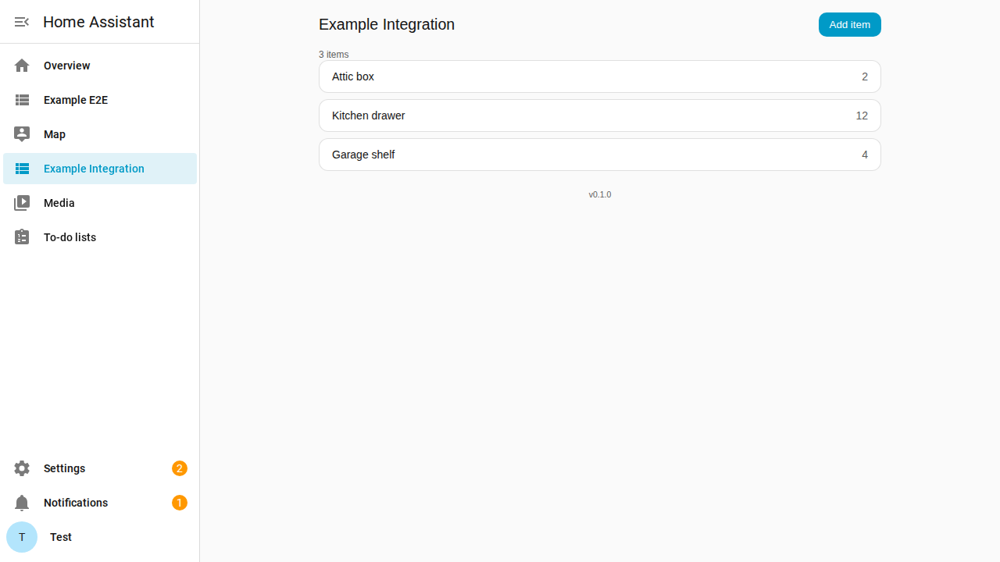
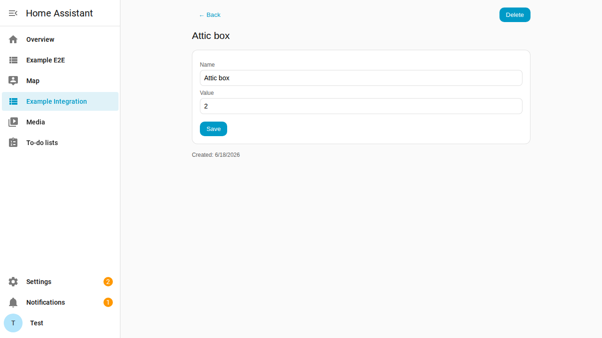
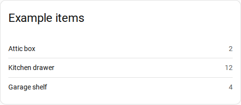

# HA Integration Template

[![Integration Usage][usage-shield]][usage]
[![GitHub Downloads][downloads-shield]][releases]
[![GitHub Release][release-shield]][releases]
[![GitHub Release Date][release-date-shield]][releases]
[![GitHub Activity][commits-shield]][commits]
[![License][license-shield]](LICENSE)
[![hacs][hacs-shield]][hacs]
![Project Maintenance][maintenance-shield]
[![HACS Validation][hacs-validation-shield]][hacs-validation]
[![HA Version][ha-version-shield]][ha-version]

A batteries-included **template for building a Home Assistant custom integration** —
backend, a sidebar panel, a Lovelace card, translations, bus events, services, and a
full four-tier test suite, all wired to CI and HACS. Clone it, rename it, and replace
the example feature with your own.

The example feature is a tiny **items list** (`example_integration`): a set of named
items, each with a numeric value. It's deliberately trivial — the point is the
*scaffolding and conventions* around it.

## What's included

| Area | What you get |
|---|---|
| **Backend** | Pure HA-free core (`models.py`, `events.py`), a single-chokepoint `ExampleStore`, a `DataUpdateCoordinator`, a `sensor` platform, a `config_flow`, and `diagnostics`. |
| **Services** | `add_item` / `update_item` / `delete_item` — the automation-facing contract, with `services.yaml` + localization. |
| **Events** | `example_integration_item_{created,updated,deleted}` fired at the store chokepoint, documented in [`docs/EVENTS.md`](docs/EVENTS.md). |
| **Frontend** | A deep-linked sidebar **panel** (admin) and a dashboard **Lovelace card** (display), TypeScript + Rollup, with a tiny dependency-free i18n. |
| **Translations** | Backend `strings.json` + `translations/` and frontend `src/locales/` (`en`, `de`), guarded by parity tests. |
| **Tests** | Four tiers: pure unit, **in-process HA** component, Docker integration, and Playwright e2e + screenshot capture. |
| **CI / release** | `lint`, `test`, `integration`, `e2e`, `mutation`, `hacs`, a version-checked `release` workflow, and a nightly run against the Home Assistant beta. Plus dependabot and issue/PR templates. |
| **Guardrails** | Automated gates covering types, prose, tests, mutation score, translations, fixtures, API-surface drift, and release consistency. See [Guardrails](#guardrails). |
| **Agentic rules** | `AGENTS.md`, `CLAUDE.md`, `.amazonq/rules/`, and a SessionStart hook — conventions and hard gates that coding agents auto-load. |
| **Rename script** | `scripts/rename.py your_domain "Your Name"` rewrites every placeholder + renames the component dir in one step. |

## The example feature

**Sidebar panel** — administration (create / edit / delete items), deep-linked so
Back/Forward work and any view is shareable by URL:





**Dashboard card** — read-only display, auto-registered in the "Add card" picker:



## Using the template

1. **Rename** — one command rewrites every placeholder (domain, display name,
   web-component / CSS / symbol prefixes) and renames the component directory:

   ```bash
   python scripts/rename.py your_domain "Your Name"
   # optional explicit short prefix (default: derived from the domain):
   # python scripts/rename.py your_domain "Your Name" --prefix yd
   ```

   Review `git diff` afterwards. (The script auto-runs `ruff format` so the result
   is lint-clean.)
2. **Replace the model.** Swap the items model (`models.py`, `store.py`, `sensor.py`,
   the panel/card UI, `strings.json`/locales) for your domain. Keep the conventions.
3. **Run the tests** (see below) and keep them green as you build.

## Running the tests

The four tiers, cheapest first (see [`AGENTS.md`](AGENTS.md) for details):

```bash
# 1. Pure unit (no HA harness; `pip install pytest`)
bash ci/test-python-unit.sh

# 2. Component — real in-process HA
pip install -r requirements-test.txt home-assistant-frontend
bash ci/test-python-component.sh

# 3. Frontend (vitest)
npm ci && bash ci/build-panel.sh && bash ci/test-frontend.sh

# 4. Docker integration + Playwright e2e (brings HA up, runs, tears down)
bash ci/e2e-up.sh

# Lint / format (also enforced in CI)
ruff check custom_components tests ci scripts && ruff format --check custom_components tests ci scripts
```

> **Important:** the component tier and the Docker integration tier **cannot share a
> pytest invocation** — `pytest-homeassistant-custom-component` pulls in
> `pytest-socket`, which blocks the real network the Docker tier needs. They run as
> separate steps.

## Quality scale

The template is built to demonstrate the practices behind Home Assistant's
[**Platinum** integration quality scale](https://developers.home-assistant.io/docs/core/integration-quality-scale/),
so the result you build on top of it starts from a strong baseline:

- **Strict typing** — fully typed, ships `py.typed`, and CI runs `mypy` against the
  integration with Home Assistant installed (`lint.yml`, config in `pyproject.toml`).
- **Async, single-coordinator core**; one mutation chokepoint (`ExampleStore`).
- **Localized exceptions** — services raise `ServiceValidationError` with
  `translation_key`s defined under `strings.json` → `exceptions` (en + de). A unit
  drift-guard (`tests/unit/test_exception_translations.py`) keeps every raise
  localizable.
- **One service device** groups the integration's entities (`DeviceInfo` with
  `entry_type=SERVICE`).

It intentionally **does not stamp a `quality_scale` tier in `manifest.json`** — the
real tier depends on the domain you build after forking (whether your integration
talks to a device, needs discovery/auth, etc.). Add the manifest key and a
`quality_scale.yaml` ledger once your integration's scope is settled.

## Guardrails

Most of the value in this template is the set of checks it brings with it. Each one
exists because the failure it catches leaves no trace on its own: a job that goes
green having tested a Home Assistant nobody runs, or a changelog entry for work that
never reached a release.

The workflow and conventions behind them live in [`AGENTS.md`](AGENTS.md) and
[`.amazonq/rules/`](.amazonq/rules/).

**On every pull request:**

| Guardrail | Where | What it catches |
|---|---|---|
| **ruff** lint + format | `lint.yml` | Style and formatting drift across `custom_components`, `tests`, `ci`, `scripts`. |
| **mypy**, strict, with Home Assistant installed | `lint.yml` | Type errors against the real HA API. The integration is fully typed and includes `py.typed`. |
| **Stale Home Assistant resolve** | `ci/check-ha-version.py` | pip quietly backtracking to a months-old HA when the runner's Python sits below HA's floor. The job stays green while checking an API nobody runs. |
| **Prose linting for AI-writing tells** | `lint.yml` (vale) | "Delve", empty padding, em-dash overuse in the README, CHANGELOG, `docs/`, and the strings Home Assistant renders. Scoped to the lines a PR touches. |
| **CHANGELOG release gap** | `ci/check-changelog-release-gap.py` | An entry folded into a section whose version is already tagged. The release job sees no version bump, skips, and the entry never reaches a user. |
| **The test tiers** | `test.yml`, `integration.yml`, `e2e.yml` | Pure unit, in-process HA component, Docker integration over REST/WS, and Playwright in a real browser. |
| **Mutation testing at 80%** | `mutation.yml` | A test that runs a line without asserting anything that would catch it being wrong. Scoped to the code the branch changed. |
| **Coverage comment** | `pytest_coverage.yml` | Untested new code, surfaced in review rather than in a report nobody opens. |
| **Translation parity** | `tests/unit/test_translations_parity.py`, `frontend/test/i18n.test.js` | Missing keys, mismatched `{placeholders}`, and English left in a non-English locale. |
| **Localized exceptions** | `tests/unit/test_exception_translations.py` | A `raise` a user could see that has no `translation_key` behind it. |
| **API-surface drift** | `tests/unit/test_api_surface.py` | A service, event, payload field, websocket command, or entity platform added to one registry and forgotten in the others. Parses the component's own source and compares it to `api_surface.py`. |
| **Seeded fixture cleanliness** | `tests/unit/test_integration_fixture_clean.py` | A local Docker run committed back into the seeded config entry, which then fails on a pristine checkout while passing locally. |
| **HACS validation + hassfest** | `test.yml`, `hacs.yml` | Manifest, brand, and repository-structure problems that block installation. |
| **Release consistency** | `release.yml` | `manifest.json` version, `const.py` `PANEL_VERSION`, and the `## [X.Y.Z]` CHANGELOG section disagreeing with each other. |
| **Dependabot auto-merge** | `dependabot-auto-merge.yml` | A bump merging on a partial check list. It waits for every check on the head commit, not the hand-maintained required-checks list. |

**Nightly, gating nothing:**

| Guardrail | Where | What it catches |
|---|---|---|
| **Home Assistant beta run** | `ha-beta.yml` | A breaking change in the next HA release, roughly four weeks before users get it. Runs the Docker and browser tiers against `beta` and type-checks against a pre-release HA, then files one reusable issue. |

**Enforced in review, not by a job:**

- **Screenshots.** A PR touching the panel or card UI is not mergeable until the body
  embeds current screenshots of the changed surface, captured with the Playwright
  harness and committed under `docs/images/`.
- **The video walkthrough.** A PR adding a new user-facing UI surface extends the tour
  in `tests/e2e/videos.capture.ts`. CI captures it and posts a sticky comment with the
  gif, so nothing is committed. Capture itself is a soft gate.
- **Every data action is a service, and every state change fires a documented event.**

## License

MIT — see [LICENSE](LICENSE).

<!--
Badge reference links. `scripts/rename.py --repo owner/name` rewrites the
`prestomation/ha-integration-template` slug and the maintainer handle here; the
domain in the "integration usage" badge (analytics query `$.example_integration.total`)
is rewritten by the normal domain replacement. The "integration usage" badge only
shows real numbers once the integration is published to HACS and appears in the
Home Assistant analytics data.
-->

[usage-shield]: https://img.shields.io/badge/dynamic/json?color=41BDF5&logo=home-assistant&label=integration%20usage&suffix=%20installs&cacheSeconds=15600&url=https%3A%2F%2Fanalytics.home-assistant.io%2Fcustom_integrations.json&query=%24.example_integration.total&style=for-the-badge
[usage]: https://analytics.home-assistant.io/
[downloads-shield]: https://img.shields.io/github/downloads/prestomation/ha-integration-template/total.svg?style=for-the-badge
[releases]: https://github.com/prestomation/ha-integration-template/releases
[release-shield]: https://img.shields.io/github/release/prestomation/ha-integration-template.svg?style=for-the-badge
[release-date-shield]: https://img.shields.io/github/release-date/prestomation/ha-integration-template?style=for-the-badge
[commits-shield]: https://img.shields.io/github/last-commit/prestomation/ha-integration-template?style=for-the-badge
[commits]: https://github.com/prestomation/ha-integration-template/commits/main
[license-shield]: https://img.shields.io/github/license/prestomation/ha-integration-template.svg?style=for-the-badge
[hacs-shield]: https://img.shields.io/badge/HACS-Custom-41BDF5.svg?style=for-the-badge
[hacs]: https://github.com/hacs/integration
[maintenance-shield]: https://img.shields.io/badge/maintainer-%40prestomation-blue.svg?style=for-the-badge
[hacs-validation-shield]: https://github.com/prestomation/ha-integration-template/actions/workflows/hacs.yml/badge.svg
[hacs-validation]: https://github.com/prestomation/ha-integration-template/actions/workflows/hacs.yml
[ha-version-shield]: https://img.shields.io/badge/Home%20Assistant-2024.1%2B-blue.svg?style=for-the-badge
[ha-version]: https://www.home-assistant.io/
