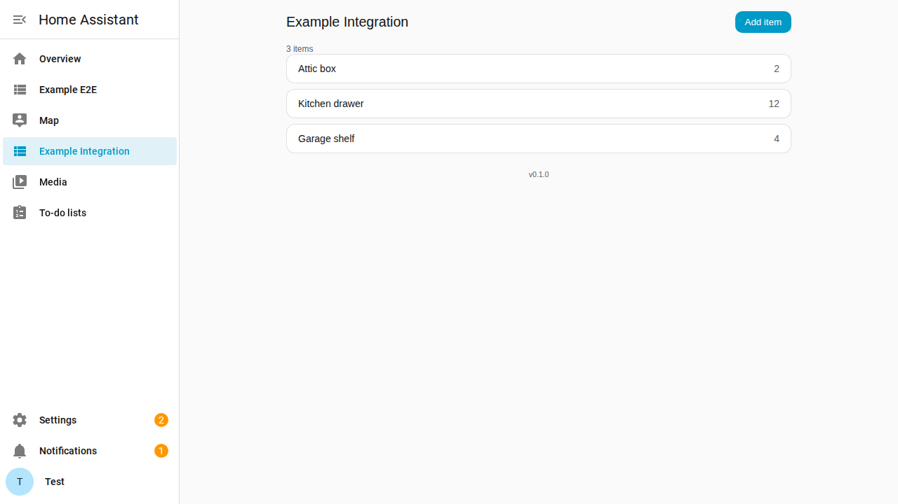
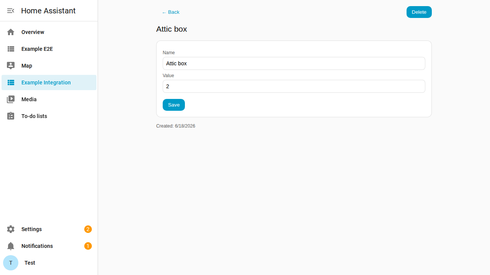
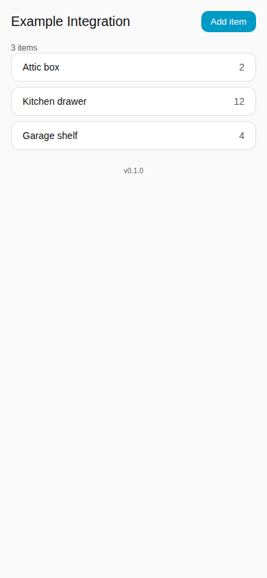

# The panel

The panel is the page in the Home Assistant sidebar where you manage the items. Use it
to create, edit and delete items.

## Add an item

1. Open **Example Integration** in the sidebar.
2. Select **Add item**.
3. Enter a name and a value.
4. Select **Save**.

The value is an integer from -1,000,000 to 1,000,000. The name must not be empty.

## Edit or delete an item

1. Select the item in the list. The detail page opens.
2. Change the name or the value and select **Save**, or select **Delete**.

## Links to a page

Each page of the panel has its own URL. The list is at `/example-integration`, and an
item is at `/example-integration/items/<id>`. Use the browser **Back** and **Forward**
buttons to move between the pages. If an item is deleted, its URL shows a notice.

## Phone

The panel works at phone width.

