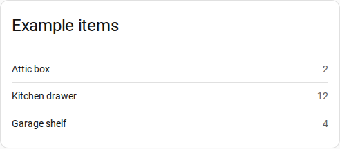

# Dashboard card

The dashboard card lists the items and their values. The card only shows data. To change
an item, use [the panel](../start/panel.md).



## Add the card

1. Open a dashboard and select **Edit dashboard**.
2. Select **Add card** and find **Example Integration card** in the card picker.
3. Optional: enter a title.
4. Select **Save**.

The integration adds the card to the card picker. It needs no manual resource.

## YAML

```yaml
type: custom:example-card
title: Items
```

| Option | Type | Default |
|---|---|---|
| `title` | string | Example items |

The card updates when an item changes, from any surface.
